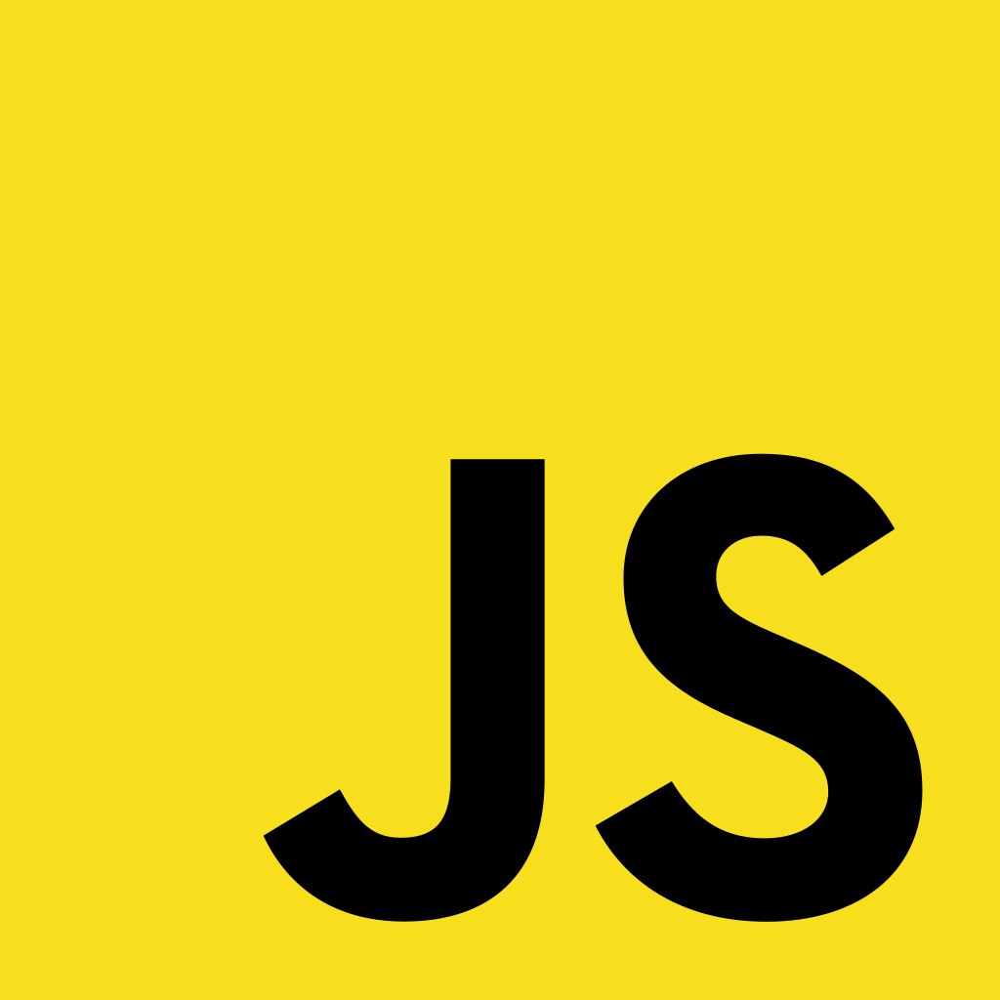

<div align="center">

</div>

# JavaScript

## 📑 INDEX

0. [HOME](./README.md)
1. [this가 자바스크립트에서 어떻게 작동하는가?](#1-this가-자바스크립트에서-어떻게-작동하는가)
2. [hoisting 이란?](#2-hoisting-이란)
3. [Event Loop 이란?](#3-event-loop-이란)
4. [분해할당 이란?](#4-분해할당-이란)

---

## 1. `this`가 자바스크립트에서 어떻게 작동하는가?

`this`의 값은 함수가 호출되는 방식에 따라 달라진다. 규칙은 다음과 같다.

1.  `new` 키워드를 사용하는 경우, 함수 내부에 잇는 `this`는 완전히 새로운 객체이다.
2.  `apply`, `call`, `bind`가 함수의 호출 및 생성에 사용되는 경우, 함수 내의 `this`는 인수로 전달된 객체이다.
3.  `obj.method()`와 같이 함수를 메서드로 호출하는 경우, `this`는 함수가 프로퍼티인 객체이다.
4.  함수가 자유함수로 호출될 경우, 위 조건에 해당 없다면 `this`는 전역 객체이다. 브라우저에서는 `window` 객체이다. 엄격모드(`use strict`)일 경우, 전역 객체 대신 `undefined`가 된다.
5.  위 규칙이 중복된다면 상위 규칙에 따라 `this`값을 설정한다.
6.  화살표 함수의 경우, 위 규칙 모두 무시하고 생성된 시점에서 주변 스코프의 `this`값을 받는다.

<div align="right">- CreatedAt 2022.12.01</div>

## 2. `hoisting` 이란?

> hoist: 들어[끌어]올리다

호이스팅은 함수 안에 있는 선언들을 모두 해당 함수 유효 범위의 최상단에 선언하는것을 말한다. 자바스크립트 함수는 실행되기 전 함수 안에 필요한 변수값들을 모두 모아서 유효범위의 최상단에 선언한다.

```JavaScript
// var 선언이 호이스팅된다.
console.log(foo); // undefined
var foo = 1;
console.log(foo); // 1

// let, const는 호이스팅되지 않는다.
console.log(bar); // ReferenceError: bar is not defined
let bar = 2;
console.log(bar); // 2
```

함수 선언은 함수 몸체가 호이스팅되는 반면, 변수 선언 형태로 작성된 함수 표현식은 변수 선언만 호이스팅된다.

```JavaScript
// 함수선언
console.log(foo); // [Function: foo]
foo(); // foooo!
function foo () {
  console.log("fooo!");
}
console.log(foo); // [Function: foo]

// 함수 표현식
console.log(bar); // undefined
bar(); // Uncaught TypeError: bar is not a function
var bar  = function () {
  console.log("barrr!");
}
console.log(bar); // [Function: bar]
```

<div align="right">- CreatedAt 2022.12.01</div>
<div align="right">- UpdatedAt 2022.12.04</div>

## 3. `Event Loop` 이란?

이벤트 루프는 콜 스택을 모니터하고 태스크 큐에서 수행할 작업이 있는지 확인하는 단일 스레드 루프다. 콜 스택이 비어 있고 태스크 큐에 콜백 함수가 있는 경우, 함수는 큐에서 제거되고 실행될 콜 스택으로 푸시된다.

```JavaScript
const foo = () => console.log("First");
const bar = () => setTimeout(() => console.log("Second"), 500);
const baz = () => console.log("Third");

bar();
foo();
baz();
```


### JS Engine

자바스크립트 엔진은 `메모리 힙`과 `콜스택`으로 구성되어 있다. (구글의 V8엔진)
자바스크립트는 단일 스레드 프로그래밍 언어인데 콜스택이 하나라는 의미다.

- Memory Heap: 메모리 할당이 일어나는 곳
- Call Stack: 코드가 실행될 때 쌓이는 곳(LIFO)

### Web APIs

브라우저에서 제공하는 API이다. DOM, Ajax, Timeout 등이 있다.
`콜스택`에서 실행된 비동기 함수는 Web API를 호출하고, Web API는 `콜백함수`를 `콜백 큐`에 넣는다.

### Callback Queue

비동기적으로 실행된 `콜백함수`가 보관되는 영역이다. (FIFO)

### Event Loop

이벤트 루프는 `콜스택`과 `콜백큐`의 상태를 체크하여, 콜스택이 빈상태일때, 콜백큐의 첫번째 콜백을 콜스택으로 밀어 넣는다. 이러한 반복적인 행동을 `틱(tick)`이라 부른다.


<div align="right">- CreatedAt 2022.12.04</div>

## 4. 분해할당 이란?

분해할당은 ES6에서 사용할 수 있는 표현식으로 객체나 배열의 값을 추출하여 다른 변수에 배치하는 방법이다.

- 배열 분해할당

```JavaScript
// 변수 할당.
const foo = ['one', 'two', 'three'];

const [one, two, three] = foo;
console.log(one); // "one"
console.log(two); // "two"
console.log(three); // "three"

// 변수 교환
let a = 1;
let b = 3;

[a, b] = [b, a];
console.log(a); // 3
console.log(b); // 1
```

- 객체 분해할당

```JavaScript
// 변수 할당.
const o = {p: 42, q: true};
const {p, q} = o;

console.log(p); // 42
console.log(q); // true
```

<div align="right">- CreatedAt 2022.12.04</div>
