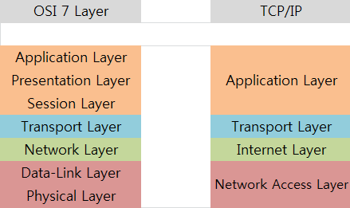

# Network

## 📑 INDEX

0. [HOME](./README.md)
1. [OSI 7 Layer & TCP/IP 4 Layer?](#1-osi-7-layer--tcpip-4-layer)

   1.1. [OSI 7 Layer Overview](#11-osi-7-layer-overview)

   1.2. [OSI 7 Layer](#12-osi-7-layer)

   1.3. [TCP/IP 4 Layer Overview](#13-tcpip-4-layer-overview)

   1.4. [TCP/IP 4 Layer](#14-tcpip-4-layer)

   1.5. [각 계층별 관련 프로토콜](#15-각-계층별-관련-프로토콜)

2. [HTTP & HTTPS](#2-http--https)

   2.1. [HTTP 란 ?](#21-http-란)

   2.2. [HTTPS 란 ?](#22-https-란)

   2.3. [HTTP vs HTTPS](#23-http-vs-https)

---

## 1. OSI 7 Layer & TCP/IP 4 Layer?

### 1.1 OSI 7 Layer Overview

OSI 모델은 국제표준화기구(ISO)에서 개발한 네트워크 기술의 기본이 되는 모델로, 컴퓨터 네트워크 프로토콜 디자인과 통신을 계층으로 나누어 설명한 것이다. 시스템간의 통신을 제공하는 프로토콜의 집합, 7개의 레이어로 이루어져 있다.

### 1.2 OSI 7 Layer

1. Physical Layer - 물리계층

- 데이터를 물리 매체상으로 전송하는 역할, 전송을 위해 필요한 물리적 링크의 설정, 유지, 해제를 담당한다.
- 시스템 간의 물리적인 연결과 전기 신호를 변환 및 제어
- 전송 단위는 `Bit`을 사용
- 데이터 전달의 역할

2. Data-Link Layer - 데이터링크 계층

- 네트워크 기기 간의 데이터 전송 및 물리 주소를 결정
- 전송 단위는 `Frame`, 주소는 `Mac`
- 물리게층의 있는 그대로의 전송설비를 신뢰할 수 있는 링크로 변환
- 네트워크 계층에서 정보를 받아 주소와 제어 정보를 헤더와 테일에 추가한다.

3. Network Layer - 네트워크 계층

- 다른 네트워크와 통신하기 위한 경로 설정 및 논리 주소를 결정
- 전송단위는 `Packet`, 주소는 `IP`
- 송신측에서 수신측까지 데이터를 안전하게 전달하기 위한 논리적링크를 설정, 상위계층 데이터를 작은 크기의 패킷으로 분할하여 전송하는 역할

4. Transport Layer - 전송계층

- 신뢰할 수 있는 통신을 구현
- 전송단위는 `Segment`, 주소는 `Port`

5. Session Layer - 세션계층

- 세션 체결, 통신 방식을 결정
- 전송 단위는 `message`

6. Presentation Layer - 표현계층

- 문자 코드, 압축, 암호화 등의 데이터를 변환
- 전송 단위는 `message`

7. Applicaion Layer - 응용계층

- 이메일 & 파일 전송, 웹사이트 조회 등 애플리케이션의 서비스 제공
- 전송 단위는 `message`

### 1.3 TCP/IP 4 Layer Overview

현재의 인터넷에서 컴퓨터들이 정보를 주고 받는데 쓰이는 프로토콜의 모음이다.

### 1.4 TCP/IP 4 Layer

1. Network Access Layer - 네트워크 접속 계층

- OSI 7 계층에서 물리계층과 데이터링크 계층
- 하드웨어적인 요소와 관련된 모든 것을 지원하는 계층

2. Internet Layer - 인터넷 계층

- OSI 7 계층에서 네트워크 계층
- 전송계층으로부터 받은 데이터에 IP패킷헤더를 붙여 `IP패킷`으로 만들어 전송

3. Transport Layer - 전송 계층

- OSI 7 계층에서 전송 계층
- 네트워크 양단의 송수신 호스트 사이에서 신뢰성 있는 전송기능 제공
- 시스템의 논리주소와 포트를 가지고 있어서 각 상위 계층의 프로세스를 연결해서 통신
- 정확한 패킷의 전송을 보장하는 TCP와 정확한 정송을 보장하지 않는 UDP 프로토콜을 이용
- 데이터의 정확한 전송보다 빠른 속도의 전송이 필요한 멀티미디어 통신에서 UDP가 유용

4. Application Layer - 응용 계층

- OSI 7 계층에서 세션, 프레젠테이션, 애플리케이션 계층

### 1.5 각 계층별 관련 프로토콜

- Application Layer
  - FTP (File Transfer Protocol)
  - VSFTP (Very Secure File Transfer Protocol)
  - SNMP (Simple Network Management Protocol)
  - SMTP (Simple Mail Transfer Protocol)
  - HTTP (Hyper Text Transfer Protocol)
  - HTTPS (Hyper Test Transfer Protocol Secure)
  - DNS (Domain Name System)
- Transport Layer
  - TCP (Transmission Control Protocol)
  - UDP (User Datagram Protocol)
  - SCTP (Stream Control Transmission Protocol)
- Network Layer
  - IP (Internet Protocol)
  - ICMP (Internet Control Message Protocol)
  - IGMP (Internet Group Message Protocol)
  - ARP (Address Resolution Protocol)
  - RARP (Reverse Address Resolution Protocol)
- Data-Link Layer
  - 이더넷
    - 이더넷에 접속되어 있는 장치들은 어느때라도 데이터를 전송할 수 있는데, 전송하기 전에 회선이 사용 중인지 감시하고 있다가 회선이 비어 있을 때 데이터를 전송
    - 데이터를 전송하는 시점에 다른 장치가 동시에 전송을 개시하면 충돌이 발생하게 되며, 충돌한 데이터들은 버려지고 데이터를 전송한 장치들에게 재전송을 요구

- CreatedAt 2022.12.02

- UpdatedAt 2022.12.04

## 2. HTTP & HTTPS?

### 2.1 HTTP 란 ?

HTTP(Htper Text Transfer Protocol)란 서버/클라이언트간 데이터를 주고 받기 위한 프로토콜이다. 즉, 인터넷에서 하이퍼텍스트를 교환하기 위한 통신규약으로 80번 포트를 사용한다. HTTP서버가 80번 포트에서 요청을 기다리고 있으며, 클라이언트는 80번 포트로 요청을 보내게 된다.

HTTP는 암호화가 되지 않은 평문 데이터를 전송하는 프로토콜이기에, 중요한 데이터는 제 3자가 조회할 수 있는 문제가 있다. 이러한 문제를 해결하기 위해 HTTPS가 등장하였다.

#### HTTP의 구조

HTTP는 애플리케이션 레벨의 프로토콜로 TCP/IP 위에서 작동한다. 상태를 가지고 있지않은 Stateless 프로토콜이며 Method, Path, Headers, Body 등으로 구성 된다.

### 2.2 HTTPS 란 ?

HTTPS(Hyper Text Transfer Protocol Secure)란 HTTP에 데이터 암호화가 추가된 프로토콜이다. 443번 포트를 사용하며 네트워크 상에서 제 3자가 정보를 볼 수 없도록 암호화를 지원한다.

#### 대칭키 암호화와 비대칭키 암호화

HTTPS는 대칭키 암호화와 비대칭키 암호화 방식을 모두 사용한다. 각각의 방식은 다음과 같다.

- 대칭키 암호화
  - 클라이언트와 서버가 동일한 키를 사용해 암호화/복호화
  - 키가 노출되면 위험하지만 연산 속도 빠름
- 비대칭키 암호화
  - 1개의 쌍으로 구성된 공개키와 개인키를 이용해 암호화/복호화
  - 키가 노출되어도 비교적 안전하지만 연산 속도가 느림
  - 암호화를 공개키로 하느냐 개인키로 하느냐에 따라 얻는 효과가 다름
    - 공개키 암호화: 공개키로 암호화를 하면 개인키로만 복호화가능 -> 개인키는 나만 가지고 있으므로, 나만 볼 수 있다.
    - 개인키 암호화: 개인키로 암호화하면 공개키로만 복호화 가능 -> 공개키는 모두에게 공개되어 있으므로, 내가 인증한 정보임을 알려 신뢰성 보장

#### HTTPS의 동작 과정

1. 클라이언트가 서버로 최초 연결 시도
2. 서버는 공개키를 브라우저에게 반환
3. 브라우저는 인증서의 유효성 검사 및 세션키 발급
4. 브라우저는 세션키를 보관, 서버의 공개키로 세션키를 암호화 한 후, 서버로 전송
5. 서버는 개인키로 암호화된 세션키를 복호화하여 세션키를 얻음
6. 클라이언트와 서버는 동일한 세션키를 공유하므로 데이터를 전달할 때 세션키로 암호화/복호화

#### HTTPS 발급 과정

일반적으로 인증된 기관(Certuficate Authority)에 공개키를 전송하여 인증서 발급받는다.

1. A기업은 HTTP 기반의 애플리케이션에 HTTPS를 적용하기 위해 공개키/개인키 발금
2. CA기업에게 돈을 지불하고, 공개키를 저장하는 인증서의 발급요청
3. CA기업은 CA기업의 이름, 서버의 공개키, 서버의 정보 등을 기반으로 인증서를 생성, CA기업의 개인키로 암호화하여 A기업에게 제공함
4. A기업은 클라이언트에게 암호화된 인증서를 제공함
5. 브라우저는 CA기업의 공개키를 미리 다운받고, 암호화된 인증서를 복호화함
6. 암호화된 인증서를 복호화하여 얻은 A기업의 공개키로 세션키 공유함

### 2.3 HTTP vs HTTPS

HTTP는 암호화 과정이 없기에 보안 취약하지만 속도가 빠르다. 반면 HTTPS는 안전하게 데이터를 주고 받을 수 있지만 암호화/복호화 과정으로 속도가 느리다.(오늘날에는 차이 느끼기 힘듬) 또한 인증서를 발급하고 유지하기위한 비용이 든다.

- CreatedAt 2022.12.04

