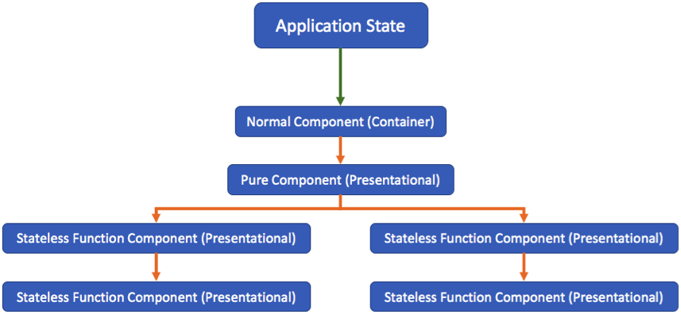
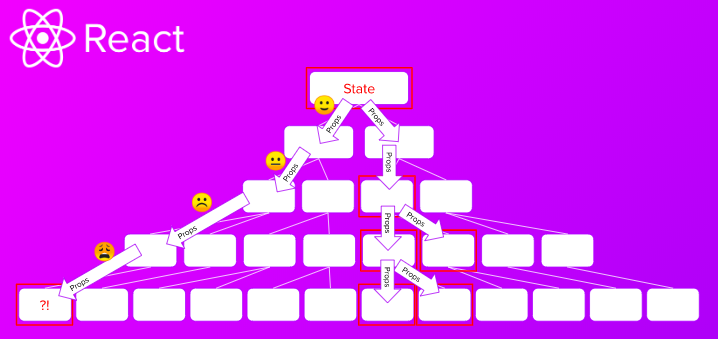
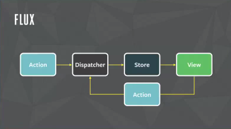
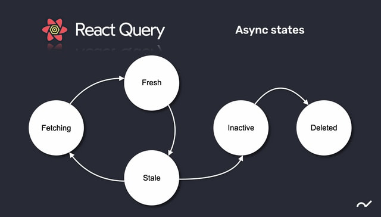
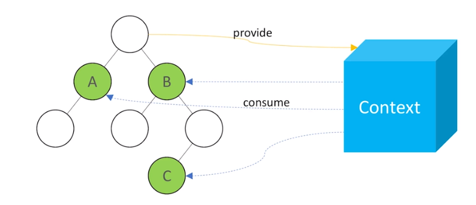

<div align="center">

</div>

# Dev

## 📑 INDEX

0. [HOME](./README.md)
1. [REST API란?](#1-rest-api란)
2. [Node.js란?](#2-nodejs란)
3. [프론트엔드의 아키텍쳐?](#3-프론트엔드의-아키텍쳐)

---

## 1. REST API란?

> REST API는 정해진 명확한 표준이 없기 때문에 REST API를 사용함에 있어 '무엇이 옳고 그른지'가 아닌 개발하는 서비스의 특징과 개발 집단의 환경과 성향 등이 충분히 고려되어 설계되어야 할 것입니다

REST(Representational State Transfer) API는 `자원을 이름으로 구분하여 해당 자원의 상태를 주고받는 모든 것`을 의미합니다.

### 1.1. REST 란?

1. HTTP URI(Uniform Resource Identifier)를 통해 자원을 명시하고,
2. HTTP Method(GET, POST 등)를 통해
3. 해당 자원에 대한 CRUD Operation을 적용하는 것을 의미한다.

### 1.2. REST 구성요소

- 자원(Resource): HTTP URI
- 행위(Verb): HTTP Method
- 행위의 내용(Representations): HTTP Message Pay Load

### 1.3. REST 특징

- **Server - Client(서버 - 클라이언트 구조)**: 서버는 API제공, 클라이언트는 사용자 인증이나 컨텍스트(세션, 로그인 정보)등을 직접 관리하는 구조로 각각의 역할이 확실히 구분되기 때문에 클라이언트- 서버에서 개발해야 할 내용이 명확해지고 서로간 의존성이 줄어든다.

- **Stateless(무상태)**: 작업을 위한 상태정보를 따로 저장하고 관리하지 않는 무상태성 성격을 갖는다. 세션 정보나 쿠기 정보를 별도로 저장하고 관리하지 않기에 API 서버는 들어오는 요청만을 단순히 처리하면 된다. 때문에 서비스의 자유도가 높아지고 서버에서 불필요한 정보를 관리하지 않음으로써 구현이 단순해진다.

- **Cacheable(캐시 처리 가능)**: REST는 HTTP 기존 웹표준을 그대로 사용하기에 웹에서 사용하는 기존 인프라를 그대로 활용가능. 따라서 HTTP가 가진 캐싱 기능 적용이 가능하다. HTTP 프로토콜 표준에서 사용하는 Last-Modified 태그나 E-Tag를 이용하면 캐싱 구현이 가능하다.

- **Layered Systems(계층화)**: REST서버는 다중계층으로 구성될 수 있으며 보안, 로드 밸런싱, 암호화 계층을 추가해 구조상의 유연성을 둘 수 있다. Proxy, Gateway 같은 네트워크 기반의 중간 매체 사용 할 수 있게 한다.

- **Uniform Interface(인터페이스의 일관성)**: URI로 지정한 리소스에 대한 조작을 통일되고 한정적인 인터페이스로 수행하는 아키텍쳐 스타일

### 1.4. 디자인 가이드

1. URI는 정보의 자원을 표현해야 한다.
2. 자원에 대한 행위는 HTTP Method로 표현한다.

```
# 회원 삭제
GET /members/delete/1 (x)
DELETE /members/1 (o)

# 회원 정보 조회
GET /members/show/1 (x)
GET /members/1 (o)

# 회원 추가
GET /members/insert/2 (x) - GET 메서드는 리소스 생성에 알맞이 않다.
POST /members/2 (o)
```

이와 같이 URI는 자원을 표현하는 데에 집중하고, 행위에 대한 정의는 HTTP METHOD를 통해 하는 것이 REST한 API를 설계하는 중심 규칙이다.

### 1.5. URI 설계 시 주의 사항

- 슬래시 구분자(/)는 계층 관계를 나타내는데 사용

```
http://restapi.example.com/houses/apartments
http://restapi.example.com/animals/mammals/whales
```

- URI 마지막 문자에 슬래시를 포함하지 않는다.

```
http://restapi.example.com/houses/apartments/ (x)
http://restapi.example.com/houses/apartments  (o)
```

- 하이픈(-)은 URI 가독성을 높이는데 사용
- 언더바(\_)는 URI에 사용하지 않는다.
- URI경로에는 소문자 사용
- 파일 확장자(.jpg 등)은 URI에 사용하지 않는다
- 바디 내용의 포맷을 나타내기 위한 파일 확장자는 URI안에 포함하지 않는다

### 1.6. 리소스 간의 관계 표현방법

리소스간 연관 관계가 있을 경우 아래와 같이 사용

```
# /리소스명/리소스 ID/관계있는 다른 리소스명

GET /users/{userid}/devices (일반적으로 has의 관계 표현할 때)

# 사용자가 좋아하는 디바이스 목록
GET /users/{userid}/likes/devices
```

### 1.7. 자원을 표현하는 Colllection과 Document

- Document: 단순한 문서
- Collection: 문서들의 집합, 객체들의 집합, **복수로 표현**
  둘 다 리소스라고 표현할 수 있으며 URI에 포현된다.

```
http:// restapi.example.com/sports/soccer
# sports라는 컬렉션과 soccer라는 도큐먼트로 표현

http:// restapi.example.com/sports/soccer/players/13
# sports, players 컬렉션과 soccer, 13(13번인 선수)를 의미하는 도큐먼트
```

### 1.8. HTTP 응답 상태 코드

| code | desc                                                                         |
| ---- | ---------------------------------------------------------------------------- |
| 200  | 클라이언트 요청 정상 수행                                                    |
| 201  | 클라이언트의 리소스 생성 요청 성공적으로 수행                                |
| -    | -                                                                            |
| 301  | 클라이언트가 요청한 리소스에 대한 URI가 변경, 변경된 URI를 헤더에 적어줘야함 |
| -    | -                                                                            |
| 400  | 클라이언트의 요청이 부적절                                                   |
| 401  | 클라이언트 인증이 되지않은 상태에서 보호된 리소스 요청                       |
| 405  | 사용불가능한 Method                                                          |
| -    | -                                                                            |
| 500  | 서버에 문제가 있을 경우                                                      |

#### Reference

- [https://meetup.toast.com/posts/92](https://meetup.toast.com/posts/92)

<div align="right">- CreatedAt 2022.12.10</div>

---

## 2. Node.js란?

> Node.js는 Chrome V8 JavaScript 엔진으로 빌드 된 `JavaScript 런타임`입니다.

자바스크립트는 독립적인 언어가 아닌 스크립트 언어이다. 스크립트언어는 특정한 프로그램 안에서 동작하는 프로그램이기 때문에 웨 브라우저 프로그램 안에서만 동작한다. 즉 웹 브라우저(크롬, 사파리 등)가 없으면 사용할 수가 없는데 이것이 Node.js가 나온 이유이다.

자바스크립트를 웹 브라우저에서 독립시킨 것으로 터미널프로그램에서 브라우저 없이 실행이 가능해졌다. 이를 이용해 서버를 만들 수 있게 되었다. -> 한가지 언어로 웹페이지를 만들수 있게 됨

- Node.js는 노드를 통해 다양한 자바스크립트 애플리케이션을 실행할 수 있다.
- Node.js는 자바스크립트를 서버에서도 사용할 수 있도록 만든 프로그램
- Node.js는 V8이라는 자바스크립트 엔진 위에서 동작하는 자바스크립트 런타임(환경)
- Node.js는 서버사이드 스크립트 언어가 아닌 프로그램(환경)이다.
- Node.js는 웹서버와 같이 확장성있는 네트워크 프로그램을 제작하기 위해 만들어짐
- Node.js는 확장성 잇는 네트워크 어플리케이션 개발에 사용되는 소프트웨어 플랫폼
- 사용언어: 자바스크립트
- 특징: Non-blocking I/O, 단일스레드, 이벤트 루프

### 2.1. 자바스크립트 런타임

런타임이란 특정언어로 만든 `프로그램을 실행할 수 있는 환경`을 뜻한다. 따라서 노드는 자바스크립트 프로그램을 컴퓨터에서 실행할 수 있게하는 `자바스크립트 실행기`이다.

### 2.2. 이벤트 기반(Event-driven)

노드는 V8과 더불어 libuv라는 라이브러리를 사용하는데 이는 노드의 특성인 이벤트기반, 논블로킹I/O 모델을 구현하고 있다. 이벤트기반이란 이벤트가 발생할 때 미리 지정해둔 작업을 수행하는 방식을 말한다. 즉 이벤트 기반 시스템에서는 특정 이벤트가 발생할 때 무엇을 할지 미리 등록해두고 이를 이벤트리스너에 콜백함수로 등록한다.

i. 이벤트 리스너에 콜백함수 등록  
ii. 이벤트 발생  
iii. 콜백함수 호출  
iiii. 이벤트가 끝난 후 노드는 다음 이벤트 발생할 때까지 대기

### 2.3. 이벤트 루프

본 문서의 [1.JAVASCRIPT.md/Event Loop 이란?](./1.JAVASCRIPT.md/#3-event-loop-이란)에서 다루었다.

이벤트 루프는 여러이벤트가 동시 발생할 때 어떤 순서로 호출 할지 이벤트루프가 판단한다. 노드는 이벤트가 종료될 때까지 이벤트 처리를 위한 작업을 반복하므로 루프라고 부른다. 이를 활용하여 오래 걸리는 작업을 효율적으로 처리한다.

### 2.4. 논 블로킹 I/O

작업에는 `동시에 실행가능한 작업`, `동시 실행 불가능한 작업` 두가지가 있다.
입력/출력(파일시스템접근, 네트워크 요청 등)과 같은 작업을 할 때 노드는 비동기 방식으로 블로킹을 만들지 않게 끔 처리한다. -> 논블로킹  
즉, 함수 호출 시 당장 실행하는 것이 아닌(동기->블로킹) 어느 곳에 쌓아 두고 동시에 요청을 처리(비동기->논블로킹) 요청이 완료된 순서대로 처리한다.

- 비동기: 이전 작업이 완료될 때까지 대기하지 않고 동시에 작업을 수행한다.
- 동기: 이전 작업이 끝나야만 다음 작업을 수행한다.

### 2.5. 싱글 스레드

Node.js는 싱글스레드, 논 블로킹 모델로 싱글 스레드가 혼자서 일을 처리하지만 들어오는 요청 순서가 아닌 논 블로킹 방식으로 이전 작업이 완료될 때까지 대기하지 않고 다음 작업을 수행한다.

- 프로세스 : 운영체제에서 할당하는 `작업의 단위`이다. 노드나 웹 브라우저 같은 프로그램은 개별적인 프로세스이다. 프로세스 간에는 메모리 등의 자원을 공유하지 않는다.

- 스레드 : 스레드는 프로세스 내에서 실행되는 `흐름의 단위`이다. 프로세스는 스레드를 여러 개 생성해 여러 작업을 동시에 처리할 수 있다. 스레드들은 부모 프로세스의 자원을 공유한다. 같은 주소의 메모리에 접근 가능하므로 데이터를 공유할 수 있다.

#### Reference

- [https://hanamon.kr](https://hanamon.kr/nodejs-%EA%B0%9C%EB%85%90-%EC%9D%B4%ED%95%B4%ED%95%98%EA%B8%B0/)

<div align="right">- CreatedAt 2022.12.15</div>

---

## 3. 프론트엔드의 아키텍쳐?

> 아키텍처란 구조화 된 옷장과 비슷한 겁니다. 처음 개발 할 때에는 규칙없이 그냥 코드를 만들다 보면 덩치가 커지는 순간 불편함이 생기고 정리가 안 되는 시점이 생깁니다. 그러니 처음부터 특정한 규칙을 만들어서 개발을 하는게 좋다는 것을 알게 되고 규칙을 하나씩 만들어가며 개발을 하다보면 이것이 반복이 되어 하나의 특정 패턴이 만들어집니다. 이러한 패턴들을 모두가 이해하고 따를 수 있도록 하는 구조를 아키텍쳐라고 부릅니다. [(https://velog.io/@teo)](https://velog.io/@teo)

### 3.1. MVC Pattern

- Model (데이터)
- View (화면)
- Controller (컨트롤러)

Model의 데이터를 받아서 화면에 그리고, 화면으로부터 사용자의 동작을 받아서 Model을 변경한다. Model과 View 사이 중간 역할을 Controller가 수행한다. `Model과 View간의 의존관계를 최소화` 해서 화면의 수정이 데이터수정에 영향을 미치지 않고 데이터 수정이 화면의 수정에 영향을 미치지 않고자 함이다

### 3.2. MVVM Pattern

- Model
- View
- ViewModel

컨트롤러의 반복적인 기능이 선언적인 방식으로 개선되었다. Model과 View의 관점을 분리하지 않고 `하나의 템플릿`으로 관리한다.

### 3.3. Container-Presenter Pattern

- Container: 비즈니스 로직을 관장하는 컴포넌트
- Presenter: 데이터만 뿌려주는 컴포넌트

화면단위가 아닌 더 작게 `재사용` 할 수 있는 단위(`Component`)로 만들어서 조립하는 방식이다.



#### 3.3.1. Container-Presenter 패턴의 한계: Props Drilling Problem

컴포넌트 구조가 복잡해지며 하위에 특정값을 전달하기 위해서는 중간레벨의 컴포넌트가 전부 props를 가져야 하는 문제가 발생한다.



- Props Drilling Problem

### 3.4. FLUX Pattern

컴포넌트의 재사용성과 독립성을 지나치게 강조하니 같은 데이터를 공유하는 과정에서 props를 통해 데이터를 전달하는 과정에 Model의 관리가 파편화되는 문제가 있다.

이러한 Props Drilling Problem을 해결하기 위한 새로운 아키텍쳐 FLUX패턴은 MVC의 개념에서 벗어난 단방향 아키텍쳐(uni-directional architecture)이다.

기존의 컴포넌트를 지향하는 MVC가 아니라 View를 하나의 범주로 두고 View에서 `Action`을 호출하면 `Dispatcher`를 통해 `Store`라는 공간에 Data가 보관이 되고 다시 뷰로 전달되는 흐름을 설명한다.




- MVC와 FLUX

#### 3.4.1. Redux

Redux는 FLUX 패턴을 이용한 구현체이다. FLUX 패턴은 View를 각각의 MVC 컴포넌트 관점으로 보는 것이 아니라 하나의 큰 View로 이해하고 View에서는 Dispatch를 통해서 Action을 전달하면 Action은 Reducer를 통해서 Data가 Store에 보관이 되고 Store에 들어있는 데이터는 다시 View로 연결이 되는 방식이다.

공통적으로 사용되는 비즈니스 로직의 layer와 View의 layer를 완전히 분리시켜 상태관리라는 방식으로 관리한다. 각각의 독립된 컴포넌트가 아닌 하나의 거대한 View 영역으로 간주한다. 둘 사이의 관계는 Action과 Reducer 라는 인터페이스로 분리, Controller는 양방향이 아닌 단방향 Cycle을 이루도록 설계되었다. Redux, Vuex 등이 대표적인 상태관리 라이브러리이다.


- Props Drilling Problem & Redux

#### 3.4.2. FLUX 패턴의 한계

간단한 구조에서는 Props Drilling Problem이 치명적이지 않다. 하지만 상태를 관리하기 위해서 Action, Dispatch, Reducer를 만들고 관리하는데 들어가는 많은 부수적인 코드들로 인해 관리가 어려워진다.

### 3.5. Observer-Observable Pattern

Props Drilling Problem 문제를 다른 식으로 푼 패턴이다. FLUX와 동일하게 거대한 View와 상태관리인 Model을 나누는 관점은 동일하다. 복잡함을 야기하는 Dispatch와 Action을 배제하고 값이 바뀌면 바뀐 값을 모두에게 전달을 한다는 개념이다.

초창기 Mobx가 이러한 방식을 기반으로 하되 Redux의 영향을 받아 용어는 Action과 Reaction이라는 방식을 취했다.

### 3.5. MVI Pattern

- Model
- View
- Intent

기존 FLUX 패턴을 Dispatch, Action, Update의 인터페이스를 전부 Observable를 이용한 스트림(Stream)의 방식으로 만들었다. 비동기 문제를 해결하고 장황한 문법을 하나의 인터페이스로 통일시켰다.

### 3.6. 그 외

#### 3.6.1. React-Query - MVC의 개념 확대

React-Query는 이러한 상태관리에 편향되어 있던 시각에서 벗어나 고전적인 ajax의 데이터를 Model로 간주한다. 대부분의 프론트엔드 개발은 서버 데이터를 CRUD하고 시각으로 그리는 것에 중점이 되어 있는데 FLUX나 Atomic은 너무 복잡한 방법이라는 것이다.

- Model: 서버와의 fetch 영역
- View: 리액트
- Controller: query와 mutation이라는 2가지의 인터페이스를 통해 서버데이터의 상태를 관리하고 캐싱, 동기화, refetch 등을 관리하는 역할



#### 3.6.2. Atomic 패턴 - Recoil, Svelte Store, Vue Composition, jotai

- View와 Model은 분리
- 중간의 과정은 자율에 맡기고 간단하게 Model에 접근하는 법만 제공
- 동기화, 동시성 처리가 중요

#### 3.6.3. Context와 hook, props 상속

Props Drilling Problem이 문제라면 새로운 개념을 만들기보다 props만 새로 뚫지 않는 방법등을 제공하면 되지 않느냐는 시각이다. 컴포넌트 트리에서 Context라는 거대한 공통 조상을 만들고 그 Context로 부터 데이터를 제공을 받는 방식이다. 개념적으로는 별도의 Store를 두는 FLUX와 비슷한 느낌이 있어서 최근에는 복잡한 문법을 가지고 만들어야 하는 Redux보다는 React의 기본 기능인 Context API를 쓰겠다는 움직임이 생기고 있다.



#### Reference

- [https://velog.io/@teo](https://velog.io/@teo/%ED%94%84%EB%A1%A0%ED%8A%B8%EC%97%94%EB%93%9C%EC%97%90%EC%84%9C-MV-%EC%95%84%ED%82%A4%ED%85%8D%EC%B3%90%EB%9E%80-%EB%AC%B4%EC%97%87%EC%9D%B8%EA%B0%80%EC%9A%94)

<div align="right">- CreatedAt 2022.12.16</div>

---
