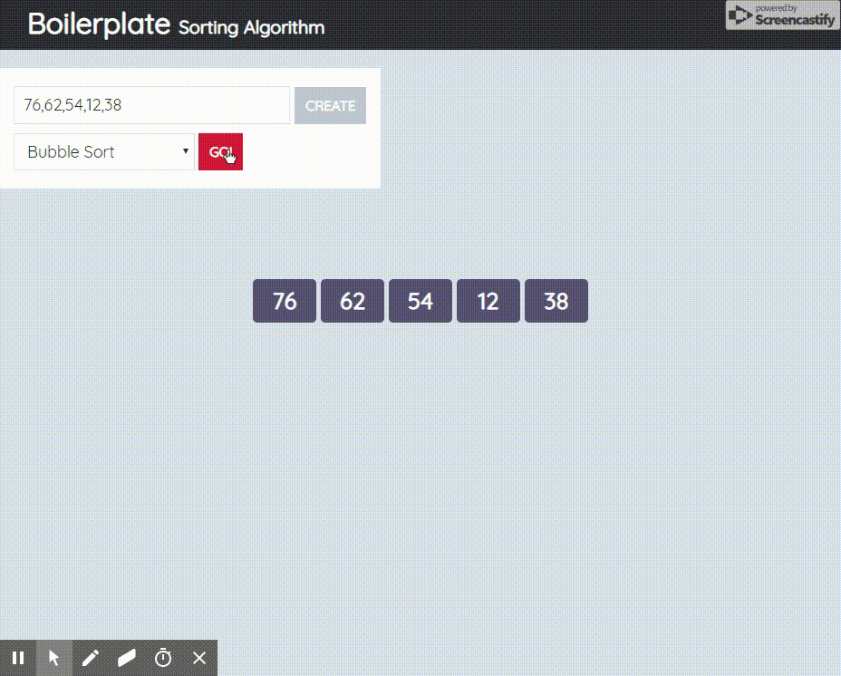

# 버블 정렬(Bubble Sort)

## 특징

- 버블 정렬은 두 인접한 원소를 검사하여 정렬하는 방법
- 구현이 단순하다.
- 수행 시간이 오래 걸린다.
- 불필요한 교환이 이뤄질 가능성이 큼

<div>


</div>

## 로직

1. 인접한 두 요소를 마지막 요소까지 모두 비교하며 교환하거나 유지하면서 정렬
2. 1회전을 수행하면 정렬조건에 따라 가장 크거나 작은 요소가 맨뒤로 이동하기 때문에 2회전 부터 가장 끝 요소는 정렬에서 제외 (1회전 수행때마다 제외되는 요소가 1개씩 늘어나게 됨)

## 시간복잡도

| Name            | Best |    Average    |     Worst     | Memory | Stable | Comments |
| --------------- | :--: | :-----------: | :-----------: | :----: | :----: | :------- |
| **Bubble sort** |  n   | n<sup>2</sup> | n<sup>2</sup> |   1    |  Yes   |          |

## 소스 코드

```javascript
const bubblesort = (arr) => {
  for (let i = 0; i < arr.length; i++) {
    for (let j = 0; j < arr.length - (i + 1); j++) {
      if (arr[j] > arr[j + 1]) {
        [arr[j], arr[j + 1]] = [arr[j + 1], arr[j]];
      }
    }
  }

  return arr;
};
```

#### Reference

- [wikipedia](https://ko.wikipedia.org/wiki/%EB%B2%84%EB%B8%94_%EC%A0%95%EB%A0%AC)
- [https://im-developer.tistory.com/133](https://im-developer.tistory.com/133)

<div align="right">- CreatedAt 2022.12.28</div>

---

[Back](../README.md)
