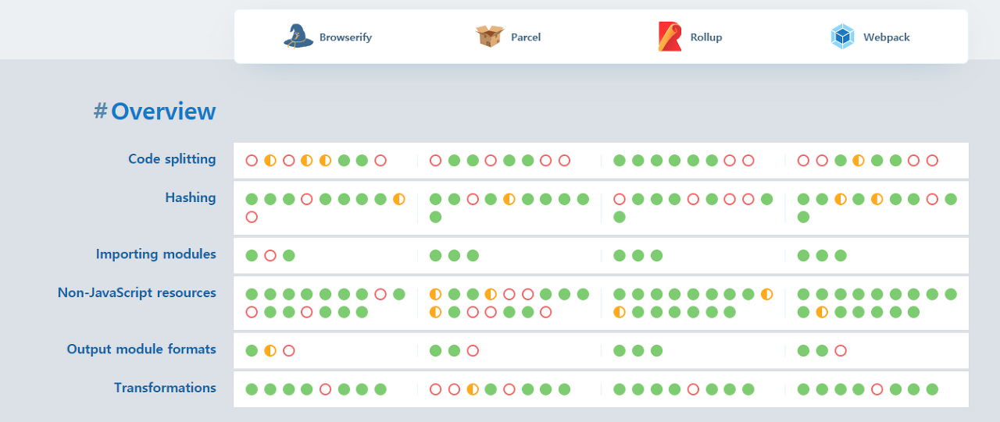

# 번들러(Bundler)란?

- `번들러`에 대하여 알아본 후, [웹팩 핸드북](https://joshua1988.github.io/webpack-guide/)을 참고해 [웹팩 실습 진행](https://github.com/jiheon788/webpack-prac)

## 탄생 배경

- 웹 초창기에는 웹사이트 규모가 작고 유지보수가 쉬웠다.
- 기술이 발전하며 파일 하나 당 코드의 양과 웹 구성 파일의 수가 증가하며 문제가 발생함
  1. **중복된 이름으로 인한 충돌, 위험**
  - 대규모 웹페이지의 경우 많은 js파일로 구성되면 여러 사람이 개발에 함여하므로 함수명과 변수명이 겹친다. 이런 경우 충돌이 일어날 위험이 존재.
  2. **파일 전송 속도 문제**
  - 웹 애플리케이션을 구성하는 파일의 양이 많아 사용자에게 파일을 제공하는 시간이 오래걸린다.
  - 파일 하나에 모든 스크립트를 작성하면 유지보수 측면에 좋지 않음.

## 번들러의 등장

- 위 문제를 해결하기 위해 번들러가 등장했다.
- 번들러는 **여러개의 파일을 하나로 묶어준다.**
- 대표적으로 `webpack`, `parcel`, `rollup`, `browserify` 이 존재한다.

## 번들러의 기능

- **Bundling**: 번들러는 애플리케이션에 필요한 모든 종류의 파일들을 모듈 단위로 나누어 최소한의 파일 묶음(`번들`)로 만들어 낸다.
- **Uglyfy**: 자바스크립트파일을 외부에서 알아보기 힘들게 코드를 변환한다.
- **Transpile**: `ES6` 등 최신 문법의 자바스크립트를 모든 웹 브라우저에 작동할 수 있게 `ES5` 문법으로 변환한다.

## 번들러의 이점

1. **네트워크 병목 현상 해결**

- 여러 파일을 최적화해서 하나의 파일로 묶기 때문에 주고 받는 파일의 크기를 줄여준다.

2. **모듈 단위 코딩**

- 유지 보수를 편하게함, 코드의 가독성 향상

3. **다양한 서드파티 기능 이용**

- `webpack`의 경우 `Babel-loder`와 같은 다양한 로더를 이용하여 `모던자바스크립트`나 `SASS`를 사용할 수 있다.

## 번들러 비교

- 각각의 번들러는 장단점이 있어 프로젝트의 목적에 따라 알맞은 번들러를 사용하면 된다.
- **많은 서드파티**를 필요로 하는 복잡한 어플리케이션: `Webpack`
- **최소한의 서드파티**로 라이브러리를 만들고 싶다면: `Rollup`
- 복잡한 설정을 피하고 비교적 **간단한 어플리케이션**을 만들고 싶다면: `Parcel`

#### Reference

- [https://blog.leehov.in/24](https://blog.leehov.in/24)
- [https://velog.io/@timosean](https://velog.io/@timosean/Web-%EB%B2%88%EB%93%A4%EB%9F%ACBundler%EC%9D%98-%EA%B0%9C%EB%85%90%EA%B3%BC-%ED%95%84%EC%9A%94%EC%84%B1)

- CreatedAt 2023.01.02

---

[Back](../README.md)
