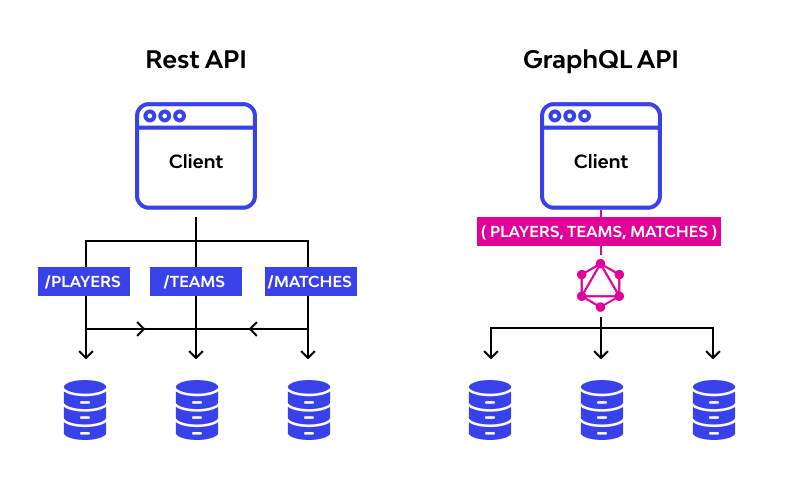

# GraphQL



GraphQL은 API를 위한 쿼리 언어(Query Language)이며 타입 시스템을 사용하여 쿼리를 실행하는 서버 사이드 런타임이다.

SQL이 데이터베이스 시스템으로부터 데이터를 가져오는 목적을 가진다면, **GraphQL은 클라이언트가 데이터를 서버로부터 가져오는 것을 목적**으로 한다.

- GraphQL은 보통 하나의 엔드포인트를 가진다.
- GraphQL은 요청할 때 **사용하는 쿼리에 따라 다른 응답**을 받을 수 있다.
- GraphQL은 **원하는 데이터(response)만** 받을 수 있다.

```
REST API
→ example.com/class
→ example.com/class/{반 index}
→ example.com/class/{반 index}/students
→ example.com/class/{반 index}/students/{학생 index}

GraphQL
→ example.com/graphql
```

### 장점

1. **HTTP 요청 횟수를 줄일 수 있다.**

   RESTful의 경우 필요한 리소스 별로 요청 해야하고, 필요한 데이터들이 부분적으로 나눠서 개발되어 있다면 그만큼 요청 횟수가 늘어난다. 하지만 **GraphQL은 원하는 정보를 하나의 쿼리에 모두 담아 요청 할 수 있다**

2. **HTTP 응답 사이즈를 줄일 수 있다.**

   Restful의 경우 응답의 형태가 정해져있기 때문에 필요한 정보만 부분적으로 요청하는 것이 힘들고, 자연스럽게 데이터의 사이즈가 클 수 밖에 없다. Facebook이 GraphQL을 개발한 초기 이유 중 하나는 모바일 사용의 증가라고 한다. **GraphQL을 사용함으로써 응답 데이터 사이즈를 최소화**하여 모바일 환경의 부담을 줄일 수 있다.

3. **프론트엔드와 백엔드 개발자의 부담을 덜 수 있다.**

   Restful API를 사용한다면 프론트엔드 개발자는 API의 request/response 형식에 의존하게 된다. 따라서 새로운 엔드포인트를 효율적이게 개발하기 위해서는 프론트엔드와 백엔드 개발자의 커뮤니케이션이 강제되는 경우가 많았다. 하지만 GraphQL은 request/response 의존도가 많이 없기 때문에, 개발자들의 API 개발 부담을 덜 수 있다.

### 단점

1. **고정된 요청과 응답만 필요할 때에는 query로 인해 요청의 크기가 Restful보다 커질 수 있다**.
2. **캐싱이 REST보다 복잡**하다.
3. 파일 업로드 구현 방법이 정해져있지 않아 직접 구현해야 한다.

REST가 가지는 한계 때문에 개발된 GraphQL이지만, **GraphQL이 완벽하게 REST를 대체 할 수는 없다** REST에 더 적합한 서비스에는 REST가 사용되는 것이 바람직하므로, **GraphQL과 REST의 장단점을 파악해 서비스에 맞는 방식을 고르는 것이 중요**하다.

#### Reference

- [www.google.com](www.google.com)

---

[Back](../README.md)
